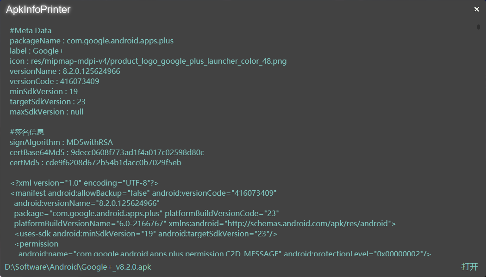
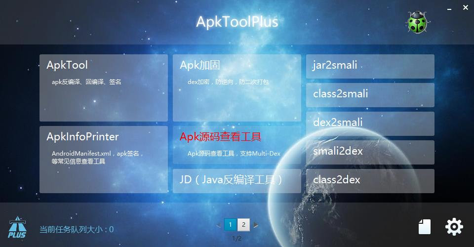
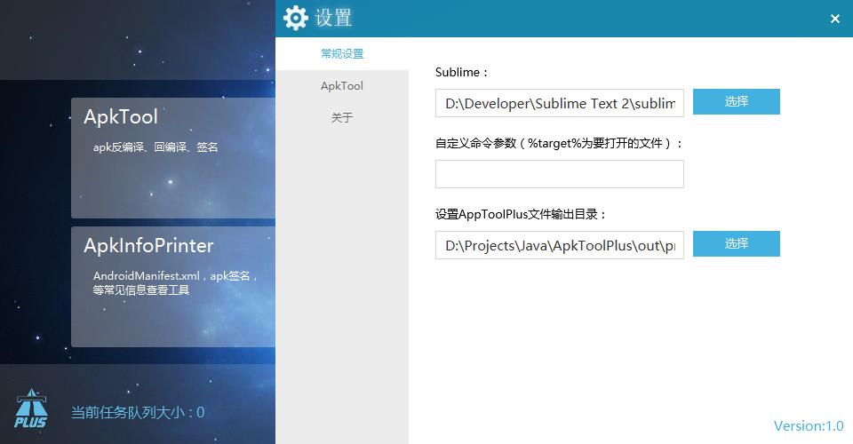

[中文](README.md) | [English](README_en.md)

# ApkToolPlus

  

ApkToolPlus is a visual cross-platform apk analysis tool.

## Features

### 1. ApkTool 

Apk decompile, compile, and sign.

### 2. Apk protection

Dex encryption, anti-reverse, prevent secondary packaging.

> Note: Protected apk will do when the signature verification, if the original signature does not match and will fail to start.

### 3. ApkInfoPrinter

Apk common information viewing tools, such as: AndroidManifest.xml, apk signature, version number and so on. Support drag directly to view apk information.

### 4. Apk source view tool 

Apk source view tool, support multi-dex.

### 5.Format conversion tool

jar2smali，class2smali，dex2smali（apk2smali），smali2dex，class2dex。

In the setup interface, you can associate [Sublime](http://www.sublimetext.com/2), and the files that are converted by tools after the association are automatically displayed in Sublime.

### 6. Angle generation tool

Icon angle generation tool

### 7. Other

- JD (Java decompiler)
- JAD (Java decompiler)
- JBE (Java bytecode editing tool)
- Proguard (Java code obfuscation tool)

## Project structure

- app：main module.
- app.Builder：build module。
- lib.ApkParser：[apk-parser](https://github.com/clearthesky/apk-parser)。
- lib.AXMLPrinter： [AXMLPrinter2](https://code.google.com/archive/p/android4me/downloads)，Binary xml file parsing library。
- lib.Jad： [Jad](https://varaneckas.com/jad/) ，Java decompiler。
- lib.JBE： [JBE](http://cs.ioc.ee/~ando/jbe/) ，Java bytecode editing tool。
- lib.JiaGu：apk protection module。
- lib.Proguard： [Proguard](https://sourceforge.net/projects/proguard/files/) ，Java code obfuscation tool， [Usage](https://www.guardsquare.com/en/proguard/manual/usage) 。
- lib.Res：resource module。
- lib.Utils：utils module。

> ApkToolPlus.jks
> - alias: ApkToolPlus
> - password: linchaolong
> - keystore password: linchaolong

## Build

> This is a IntelliJ IDEA project。
>
> Build the project dependent ant， [click here to download ant](https://ant.apache.org/bindownload.cgi)，Configure the bin directory to the environment Path variable，Execute the `ant -version` command to check if the configuration is complete.

### 1. Run

Run `app` module's `com.linchaolong.apktoolplus.Main`。

### 2. Update apk protection module
  
`lib.JiaGu` is apk protection module，if have updated，run `com.linchaolong.apktoolplus.builder.UpdateJiaGu` in the `app.Builder` module, update apk protection library to app module。

### 3. Pack ApkToolPlus

`Build -> Artifacts... -> ApkToolPlus -> Build`，ApkToolPlus.jar will be generated in the `out\artifacts\ApkToolPlus` directory, if you have installed jdk can click the jar directly to run.

## Download

> Github：https://github.com/linchaolong/ApkToolPlus

Click [here](release) to download release version of ApkToolPlus。

## Related Links

[dexknife-wj](https://github.com/godlikewangjun/dexknife-wj)：apk protect plugin, supports signature verification and dex encryption.

## Contact

- Email：linchaolong.dev@gmail.com
- Blog：https://cyrus-studio.github.io/blog/

WeChat Official Account：CYRUS STUDIO

